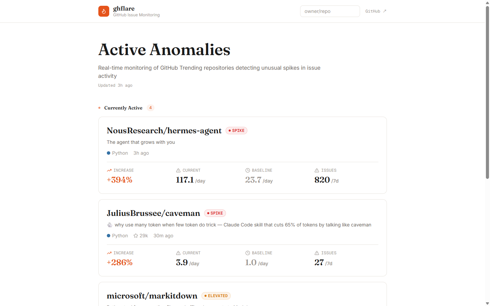
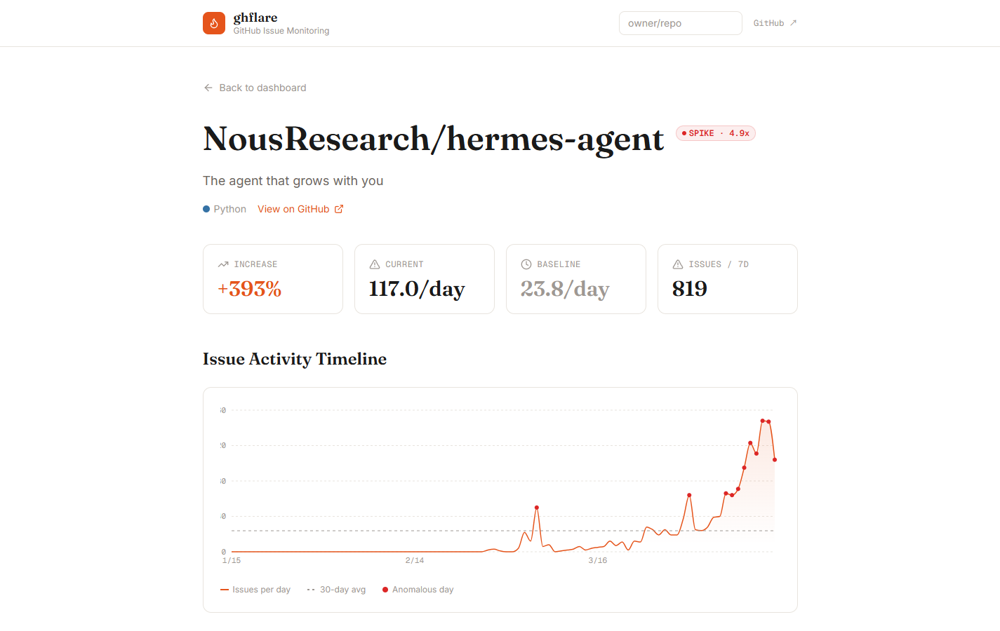

# ghflare

Detects anomalous issue activity in GitHub Trending repositories — not just "how many issues" but "how unusual is this compared to baseline."

**[ghflare.vercel.app](https://ghflare.vercel.app)**



---

## What it does

GitHub Trending shows repos gaining stars. ghflare watches the same repos for **unusual spikes in issue volume** — a signal that something is happening: a bug hitting users, unexpected traction, a breaking change shipping.

For each trending repo, it compares issue activity over the last 7 days against the previous 23-day daily average. Repos showing statistically significant deviation surface on the feed.



Each repo detail page shows:
- **Anomaly stats** — increase %, current rate vs baseline
- **90-day activity timeline** — with anomalous days highlighted
- **Topic clusters** — k-means clustering on OpenAI embeddings groups issues by theme

---

## How it works

```
GitHub Trending (daily parse)
        ↓
Fetch open issues per repo  ←  GitHub REST API
        ↓
Generate embeddings          ←  OpenAI text-embedding-3-small
        ↓
K-means clustering           ←  pure TypeScript, no external ML
        ↓
Anomaly detection            ←  recent 7d vs historical 23d daily avg
        ↓
Persist to Neon (PostgreSQL + pgvector)
        ↓
Serve via Next.js App Router
```

The anomaly score is a ratio: `(recent daily rate) / (historical daily avg)`. Repos with fewer than 5 recent issues are excluded to avoid noise from low-activity projects.

---

## Stack

| Layer | Technology |
|-------|-----------|
| Framework | Next.js 16 (App Router) |
| Language | TypeScript (strict) |
| Styling | Tailwind CSS |
| Database | Neon PostgreSQL + pgvector |
| Embeddings | OpenAI text-embedding-3-small (1536-dim) |
| Deployment | Vercel (UI/API) + GitHub Actions (pipeline, manual dispatch) |

---

## Local setup

```bash
pnpm install
```

Create `.env.local`:

```
DATABASE_URL=        # Neon connection string
GITHUB_TOKEN=        # GitHub PAT (public_repo read)
OPENAI_API_KEY=      # OpenAI API key
```

Run DB migrations:

```bash
psql $DATABASE_URL -f src/lib/db/migrations/001_init.sql
```

Start dev server:

```bash
pnpm dev
```

Run the pipeline locally:

```bash
node --env-file=.env.local --import tsx scripts/pipeline.ts
```

Or trigger it on GitHub Actions via the **Data Pipeline** workflow (Actions tab → Run workflow). Required repo secrets: `DATABASE_URL`, `OPENAI_API_KEY`, `GH_TOKEN`.

---

## Tests

```bash
pnpm vitest          # unit tests (anomaly detection, clustering)
pnpm playwright test # E2E
```
