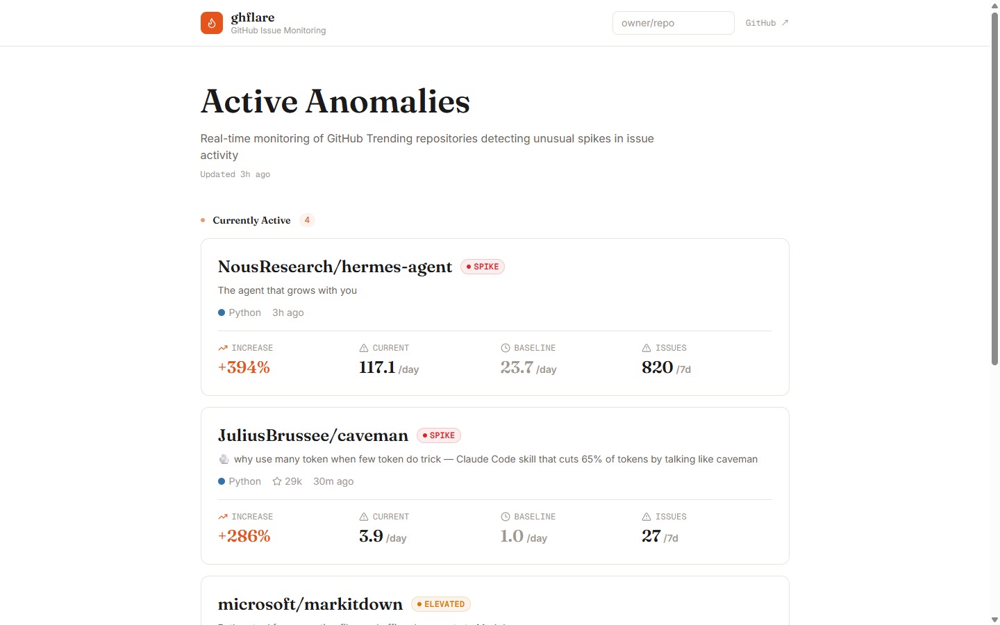
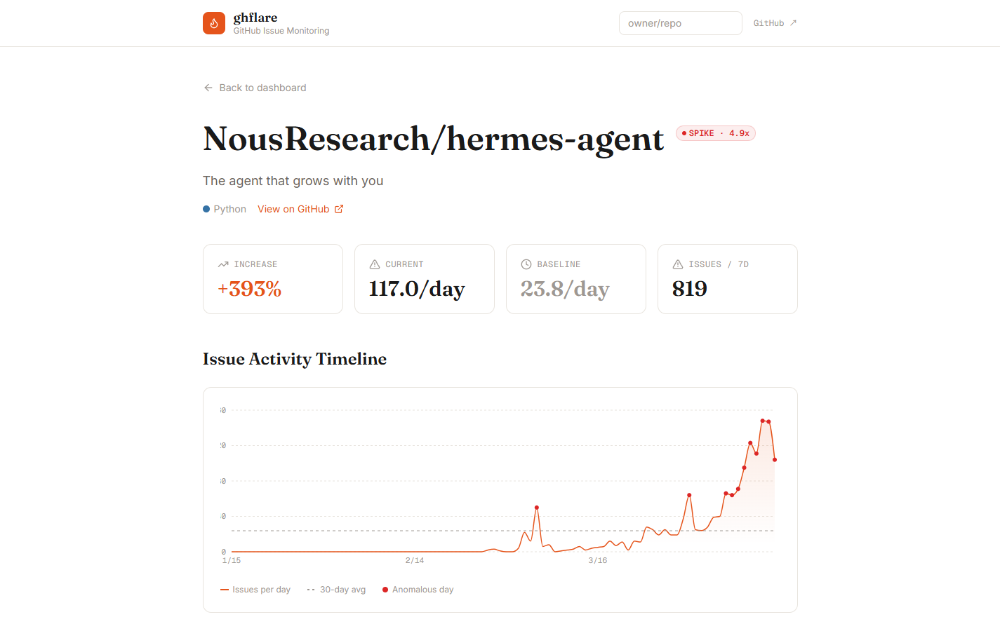

# ghflare

Detects anomalous issue activity in GitHub Trending repositories — not just "how many issues" but "how unusual is this compared to baseline."

**[ghflare.vercel.app](https://ghflare.vercel.app)**



---

## What it does

GitHub Trending shows repos gaining stars. ghflare watches the same repos for **unusual spikes in issue volume** — a signal that something is happening: a bug hitting users, unexpected traction, a breaking change shipping.

For each trending repo, it compares new-issue activity over the last 7 days against the previous 23-day daily average (floored so low-activity repos don't read as extreme). Repos showing significant deviation surface two ways: on the **web feed**, and as a **Google Chat digest** pushed at the end of each pipeline run.

Notifications are change-driven — a repo alerts when it first spikes, escalates (elevated→spike), or worsens significantly, not every day it stays elevated.



Each repo detail page shows:
- **Anomaly stats** — increase %, current rate vs baseline
- **30-day activity timeline** — with anomalous days highlighted
- **Topic clusters** — k-means clustering on OpenAI embeddings groups issues by theme

---

## How it works

```
GitHub Trending (daily parse)
        ↓
Fetch issues per repo (90d)  ←  GitHub REST API (state=all, by created_at)
        ↓
Generate embeddings          ←  OpenAI text-embedding-3-small
        ↓
K-means clustering           ←  pure TypeScript, no external ML
        ↓
Anomaly detection            ←  quasi-Poisson, recent 7d vs historical 23d
        ↓
Persist to Neon (PostgreSQL + pgvector)
        ↓
        ├─→  Serve via Next.js App Router (web feed)
        └─→  Google Chat digest  ←  change-driven, deduped
```

Anomaly detection treats the recent 7-day count as one observation against a baseline expectation (7 × the floored 23-day daily average, floored at ~1 issue/week so a near-dead repo's small bump isn't a huge spike). It scores significance with a **quasi-Poisson upper-tail test** — a normal approximation with the variance inflated (φ≈3) to absorb the overdispersion of real issue arrivals — and requires a **dual gate**: a repo is `elevated`/`spike` only if it clears *both* a practical effect size (multiplier) and a statistical bar (p-value), so a 1.5× on a busy repo and on a quiet one aren't treated alike.

Four confidence gates hold a repo at `normal` regardless of significance: too few recent issues (< 5) to act on; too thin a baseline (< 5 issues in the 23-day window) to know the repo's "normal" at all; a repo younger than 30 days, whose partial lifetime dilutes the daily average so a merely *steady* newcomer reads as a spike — since the input is already GitHub Trending, "new but hot" is redundant signal, not the "a repo I know is unusually busy today" signal this targets; or a fetch that couldn't cover the 30-day anomaly window (pagination cap on very busy repos), where the baseline is undercounted and the multiplier would be inflated. A capped fetch that still reaches past 30 days only degrades clustering/timeline — the anomaly level stays trustworthy. The figures are still computed and stored in every case — only the alert-driving level is suppressed.

The Google Chat step compares each repo's level against a per-repo state table (`repo_notification_state`) and only sends on a *change* — new anomaly, escalation, or a ≥1.5× worsening — so a persistent anomaly doesn't spam the channel. The web feed and the digest both read the latest **pipeline** snapshots only; analyses triggered manually from a repo page are stored with `source='manual'` and never shift the feed's date window.

Storage is bounded to fit Neon's free tier: issues are kept 30 days and snapshots 30, and once a repo has had no snapshot of either source for 14 days — it fell out of trending and the feed can't show it — the pipeline's cleanup step drops the repo row, cascading to its issues, clusters and snapshots. The row itself has to go: visiting a repo page only re-fetches from GitHub when the repo is absent from the DB, so keeping a stripped row would leave a permanently empty page. Issue bodies are stored truncated to the 500 chars the embedding input reads; they are never rendered.

---

## Stack

| Layer | Technology |
|-------|-----------|
| Framework | Next.js 16 (App Router) |
| Language | TypeScript (strict) |
| Styling | Tailwind CSS |
| Database | Neon PostgreSQL + pgvector |
| Embeddings | OpenAI text-embedding-3-small (1536-dim) |
| Notifications | Google Chat incoming webhook (digest) |
| Deployment | Vercel (UI/API) + GitHub Actions (pipeline, manual dispatch) |

---

## Local setup

```bash
pnpm install
```

Create `.env.local`:

```
DATABASE_URL=              # Neon connection string
GITHUB_TOKEN=              # GitHub PAT (public_repo read)
OPENAI_API_KEY=            # OpenAI API key
GOOGLE_CHAT_WEBHOOK_URL=   # optional — Google Chat space incoming webhook
NOTIFY_DRY_RUN=1           # optional — log the digest instead of sending
```

Run DB migrations (in order):

```bash
psql $DATABASE_URL -f src/lib/db/migrations/001_init.sql
psql $DATABASE_URL -f src/lib/db/migrations/002_notifications.sql
psql $DATABASE_URL -f src/lib/db/migrations/003_anomaly_stats.sql
psql $DATABASE_URL -f src/lib/db/migrations/004_repo_age_snapshot_source.sql
```

There is no migration runner — apply new numbered files manually, in order.
`002` adds `snapshots.updated_at` and the notification tables on top of `001`;
`003` adds the quasi-Poisson fields (`anomaly_p_value`, `expected_count`);
`004` adds `repos.gh_created_at` (repo-age gate) and `snapshots.source`
(pipeline/manual separation — apply before deploying code that references them).

Start dev server:

```bash
pnpm dev
```

Run the pipeline locally:

```bash
node --env-file=.env.local --import tsx scripts/pipeline.ts
```

Or trigger it on GitHub Actions via the **Data Pipeline** workflow (Actions tab → Run workflow). Required repo secrets: `DATABASE_URL`, `OPENAI_API_KEY`, `GH_TOKEN`. Add `GOOGLE_CHAT_WEBHOOK_URL` to enable the Chat digest (omit it and the send is skipped).

---

## Tests

```bash
pnpm vitest          # unit tests (anomaly detection, clustering)
pnpm playwright test # E2E
```
